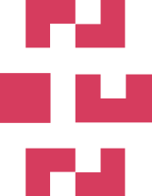

# Awesome Nouns 

<!--lint ignore double-link-->

<!--lint ignore double-link-->
> A curated list of awesome [Nouns](https://nouns.wtf) non-fungible token project resources. 

<!--lint ignore double-link-->
[Nouns](https://nouns.wtf) is a generative non-fungible token project on the Ethereum blockchain.
Nouns are 32x32 pixel characters based on people, places, and things. One noun is generated every day.

## Contents

- [Educational](#educational)
- [Governance](#governance)
- [Development](#development)
- [Miscellaneous](#miscellaneous)

## Educational

## Governance
- [Nouns Camp](https://nouns.camp) - An alternative Nouns governance client.
- [Nouns Agora](https://www.nounsagora.com) - Agora is the home of nouns voters.

## Development

## Miscellaneous
- [Nouns Center](https://nouns.center/) - Nouns Center serves as the knowledge center & resource hub for Nouns DAO.
- [Nouns Warpcast](https://warpcast.com/~/channel/nouns) - A channel to discuss Nouns and other nounish subjects.
- [Nouns Terminal](https://nouns.sh) - Advanced interface for Nouns Auction.

## Contributing

Contributions welcome! Read the [contribution guidelines](CONTRIBUTING.md) first.
